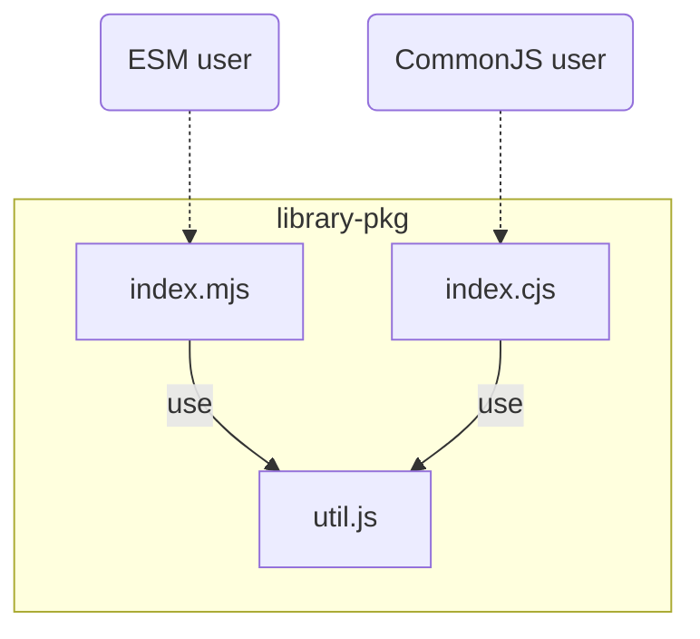

# ts-node-conditional-export-example

An example repository to explain how to build conditional exported Node.js package using TypeScript.

## :wrench: Requirements

This repository relies on TypeScript's [ECMAScript Module Support in Node.js](https://devblogs.microsoft.com/typescript/announcing-typescript-4-7-beta/#esm-nodejs) feature.

## :open_file_folder: Directory structure of the entire repo

This repo uses npm workspaces feature and the directory structure is the following:

```
(repo_root)
├── README.md
├── packages
│   └── library-pkg   # An example of Node.js library package
└── user-apps
    ├── app-esm       # An example of application package written by pure ESM
    └── app-old       # An example of application package not specified "type" (i.e. will be recognized CommonJS)
```

Here, `packages/library-pkg` is a main package. Our goal is to configure this package to be applicable from both ESM and CommonJS packages.
And `app-esm` and `app-old` packages are example of users for `packages/library-pkg`.

## :open_file_folder: Directory structure of conditional-exported package

The `library-pkg`'s structure is the following:

```
packages/library-pkg
├── src               # Source directory
│   ├── index.cts
│   ├── index.test.cts
│   ├── index.mts
│   ├── index.test.mts
│   ├── index.ts
│   ├── util.ts
│   └── util.test.ts
├── lib               # Distribution directory
│   ├── index.cjs
│   ├── index.d.cts
│   ├── index.mjs
│   ├── index.d.mts
│   ├── index.js
│   ├── index.d.ts
│   ├── util.js
│   └── util.d.ts
├── README.md
├── package.json
├── jest.config.mjs
└── tsconfig.json
```



And the `package.json` does not have `"type": "module"` field. So .js files (e.g. `lib/util.js`) are treated as not ESM but CommonJS.

## :package: How to configure conditional-exported package

We can configure provide multiple entry points using [Node.js Conditional exports feature](https://nodejs.org/api/packages.html#conditional-exports).

```json
{
  "name": "@quramy/library-pkg",
  "files": ["lib"],
  "main": "lib/index.js",
  "types": "lib/index.d.ts",
  "exports": {
    ".": {
      "import": {
        "types": "./lib/index.d.mts",
        "default": "./lib/index.mjs"
      },
      "require": {
        "types": "./lib/index.d.cts",
        "default": "./lib/index.cjs"
      }
    }
  }
}
```

The above means:

- Provide `./lib/index.mjs` file to users that prefer `import "@quramy/library-pkg"`
- Provide `./lib/index.cjs` file to users that prefer `require("@quramy/library-pkg")`
- Provide `./lib/index.js` file to users than use old Node.js (< v12.16.0)

And TypeScript's type declaration files are exported conditionally too:

- Provide `./lib/index.d.mts` file to users that prefer ESM and TypeScript >= 4.7
- Provide `./lib/index.d.cts` file to users that prefer CommonJS and TypeScript >= 4.7
- Provide `./llb/index.d.ts` otherwise

### :warning: Don't forget `types` fields

You don't forget set `types` in each `exports` block. If you miss them, users of your package can't resolve type declaration file corresponding to each exported entry point.

## :nut_and_bolt: How to configure TypeScript

We pass `--module node16` option to TypeScript via `packages/library-pkg/tsconfig.json`.

```js
/* packages/library-pkg/tsconfig.json */
{
  "compilerOptions": {
    "module": "node16",
    // skip
  },
}
```

`node16` (or `nodenext`) means that you should follow strict ECMAScript Module rules.

For example, the following import declaration statement is valid under `--module commonjs` or `--module esnext`.

```ts
import * as util from "./util";
```

However, the above statement are recognized as an error under `--module node16` and TypeScript outputs the following diagnostic message.

```
error TS2835: Relative import paths need explicit file extensions in EcmaScript
```

## :memo: Which file extension do we use?

It's simple. `tsc` compiles TypeScript files as the following table:

| TypeScript source file extension | Compiled JavaScript file extension | Generated type declaration file extension |
| :------------------------------- | :--------------------------------- | :---------------------------------------- |
| `.ts`                            | `.js`                              | `d.ts`                                    |
| `.cts`                           | `.cjs`                             | `d.cts`                                   |
| `.mts`                           | `.mjs`                             | `d.mts`                                   |

There are 2 important rules:

1. TypeScript `--module` option never affect the above table. As well as [Node.js determines module type without file content](https://nodejs.org/api/packages.html#determining-module-system), TypeScript determines output JavaScript file extension using only extension of its source file
1. Import specifiers (e.g. `from "./util.js"`) are never transpiled if you configure TypeScript to preserve import statements (e.g. `--module esnext` or `--module node16`)

For instance, let's think source files in my `library-pkg`.

`.js` files are treated as CommonJS scripts because the `package.json` doesn't have `type` field(It's [Node.js 's determining module system](https://nodejs.org/api/packages.html#determining-module-system)).
So, TypeScript sources in this packages are treated as the following:

- `src/index.ts`: is treated as a CommonJS script
- `src/index.cts`: is treated as a CommonJS script
- `src/index.mts`: is treated as an ESM
- `src/util.ts`: is treated as a CommonJS script

## :memo: How to configure Jest?

As of May 2022, Jest and well-known transformers (babel, ts-jest, swc, etc.) do not support TypeScript 4.7.
For this reason, explicitly configure TypeScript ESM settings and transformers.
In the near future, it could be rewritten using the transformers or presets (but I don't think the essence of this configure will change significantly).

```js
/* packages/library-pkg/jest.config.mjs */

export default {
  // - .mjs files are always treated as ESM by Jest default.
  // - In this package, *.js should NOT be treated as ESM.
  extensionsToTreatAsEsm: [".mts"],

  // Transpile TypeScript sources (.ts, .cts, .mts)
  transform: {
    "^.+\\.[mc]?ts$": "@quramy/jest"
  },

  // To let Jest resolve relative import spcificers like `import "./util.mjs"`,
  // look up corresponding TS source such as "./util.mts" .
  moduleNameMapper: {
    "^(\\.\\.?/.*)\\.mjs$": ["$1.mts", "$1.mjs"],
    "^(\\.\\.?/.*)\\.cjs$": ["$1.cts", "$1.cjs"],
    "^(\\.\\.?/.*)\\.js$": ["$1.ts", "$1.js"]
  },

  moduleFileExtensions: ["mts", "cts", "ts", "mjs", "cjs", "js", "json"],

  testMatch: ["**/?(*.)+(spec|test).?([mc])[jt]s"],
  testPathIgnorePatterns: ["/node_modules/", "<rootDir>/lib/"]
};
```

<details>
<summary>Transformer responsibility</summary>
<p>
Whether .ts files are treated as ESM is contextual. TypeScript determines this via using package.json's <code>type</code> field. <br />
Jest transformer should determines this as well as TypeScript does.
In Jest configuration context, transformer should transpile .ts file to ESM if <code>extensionsToTreatAsEsm</code> includes .ts .
</p>
</details>

To let Jest treat native ESM module, we should pass `--experimental-vm-modules` option to Node.js such as:

```js
/* package.json */

{
  "scripts": {
    "test": "NODE_OPTIONS=--experimental-vm-modules jest",
    // skip
  }
}
```

See also https://jestjs.io/docs/ecmascript-modules if you more details.

## License

MIT
